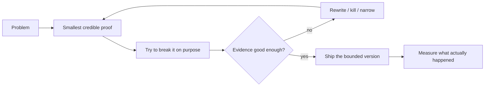

# Niyam Paneru

I build software, then immediately ask it uncomfortable questions.

`backend` · `AI agents` · `voice` · `automation` · `evaluation` · `weird side projects that somehow become serious`

> “What happens if this runs twice?” is basically my love language.

I care about systems that can explain **why** they acted, **why not**, and what happens when the network, model, browser, caller, calendar, or human does something annoying.

## If you only click four things

| | Project | What is interesting about it |
|---|---|---|
| 📞 | **[ai-booking-workflow](https://github.com/Niyam-Paneru/ai-booking-workflow)** | A booking FSM that can offer and confirm a real slot without inventing one because the conversation got awkward. |
| 🖱️ | **[attended-browser-bridge](https://github.com/Niyam-Paneru/attended-browser-bridge)** | Browser-write policy where “maybe it clicked” means **stop**, not “click harder.” |
| 🧠 | **[temporal-memory-core](https://github.com/Niyam-Paneru/temporal-memory-core)** | Personal-memory retrieval with valid time, knowledge time, supersession, and use permissions. |
| 📱 | **[ubuntu-phone-compute-bridge](https://github.com/Niyam-Paneru/ubuntu-phone-compute-bridge)** | Windows → SSH → Termux → Ubuntu jobs on an Android phone, with a tiny allowlist and result verification. |

## Voice, agents, and things that are allowed to say “no”

- **[ai-sales-call-guard](https://github.com/Niyam-Paneru/ai-sales-call-guard)** — default-deny gates around AI sales-call experiments: DNC, disclosure, self-test allowlists, daily caps, and no-PHI boundaries.
- **[agent-policy-core](https://github.com/Niyam-Paneru/agent-policy-core)** — expiring grants, idempotency, ambiguous-effect blocking, credential redaction.
- **[voice-pipeline-guard](https://github.com/Niyam-Paneru/voice-pipeline-guard)** — bounded audio and latency/failure rules for realtime voice.
- **[human-gated-research](https://github.com/Niyam-Paneru/human-gated-research)** — irreversible actions stay behind human approval tied to the exact content.
- **[dentsignal-twilio-evidence](https://github.com/Niyam-Paneru/dentsignal-twilio-evidence)** — sanitized historical telephony evidence from DentSignal.

## Memory, learning, and not lying to ourselves

- **[learning-evidence-core](https://github.com/Niyam-Paneru/learning-evidence-core)** — assisted practice is useful; it is not silently renamed “mastery.”
- **[metric-integrity](https://github.com/Niyam-Paneru/metric-integrity)** — measured/modelled labels, denominator-safe reporting, unsupported-attribution refusal.
- **[opportunity-intelligence-core](https://github.com/Niyam-Paneru/opportunity-intelligence-core)** — public opportunity evidence → hard gates → deterministic scoring → proof plan → human review.

## One weird one, because software should occasionally be fun

**[relic-zero](https://github.com/Niyam-Paneru/relic-zero)** — one panda relic, one-use invitation links, immutable bless/corrupt history, and no automatic forwarding.

Yes, this is a real repository. No, the panda does not have a blockchain.

## How I usually work

I would rather kill a weak idea early than spend a month making its dashboard prettier.

## Bigger projects behind the public slices

- **Niyam AI** — long-running personal-AI work: typed memory, provenance, temporal retrieval, evals, model adapters, and current Kaggle experiments.
- **Niyam Learning OS** — evidence-backed learning, RS-1 decision practice, CS/AI labs, English, local-first state, and a live app: **[open it](https://niyam-learning-os.niyampaneru79.workers.dev)**.
- **Browser Bridge** — attended Chrome control with fresh snapshots, bounded writes, recovery, and audit trails.
- **DentSignal** — historical AI voice/receptionist system spanning telephony, Deepgram voice, booking, handoff, and guarded sales-call experiments.

Private code stays private when publishing it would expose personal data, credentials, operational state, or a giant repo that makes review harder instead of easier. The public repos are the parts worth inspecting without needing a treasure map.

## Tools I actually use

**Python, FastAPI, JavaScript, TypeScript, Node.js, React, Next.js, PostgreSQL, SQLite, Redis, Celery, Playwright, Puppeteer, CircleCI, Azure, Cloudflare, Supabase.**

Also C, whenever I want the computer to remind me that memory has consequences.

## Case studies

**[niyampaneru.me](https://niyampaneru.me)** — larger project walkthroughs, architecture, evidence, and limitations.

## Contact

**[niyampaneru.me](https://niyampaneru.me)** · **[niyampaneru79@gmail.com](mailto:niyampaneru79@gmail.com)**
