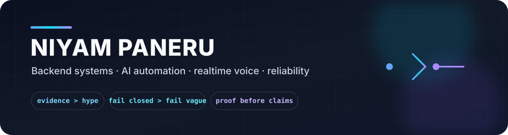

<p align="center">
  
</p>

<p align="center">
  <a href="https://niyampaneru.me"></a>
  <a href="mailto:niyampaneru79@gmail.com"></a>
  
</p>

## I build the parts that have to be right

I am a software developer focused on **backend systems, AI automation, realtime voice, and reliable agent workflows**.

My favorite problems are the ones where the happy path is easy but the failure path matters: permissions expire, side effects become ambiguous, latency breaks the budget, data is incomplete, or an agent needs to know when **not** to act.

```text
input → evidence → policy → action → proof
```

Public repositories below are intentionally small, reviewable proofs. Larger systems stay private when publishing them would expose credentials, personal data, or operational details.

## Featured systems

<table>
<tr>
<td width="50%" valign="top">

### 🛡️ [agent-policy-core](https://github.com/Niyam-Paneru/agent-policy-core)

Deny-by-default policy for tool-calling agents with expiring permissions, idempotency, ambiguous-effect blocking, and credential redaction.

**Node.js · 28 tests · CircleCI**

[Architecture](https://github.com/Niyam-Paneru/agent-policy-core/blob/main/docs/architecture.svg)

</td>
<td width="50%" valign="top">

### 🎙️ [voice-pipeline-guard](https://github.com/Niyam-Paneru/voice-pipeline-guard)

Bounded audio capture, explicit rejection reasons, fail-closed latency budgets, and metadata-only metrics for realtime voice pipelines.

**Python · 16 tests · CircleCI**

[Architecture](https://github.com/Niyam-Paneru/voice-pipeline-guard/blob/main/docs/architecture.svg)

</td>
</tr>
<tr>
<td width="50%" valign="top">

### 🔐 [human-gated-research](https://github.com/Niyam-Paneru/human-gated-research)

Evidence-ranked proposals where irreversible actions require digest-matched human approval.

**Python · 14 tests · CircleCI**

[Architecture](https://github.com/Niyam-Paneru/human-gated-research/blob/main/docs/architecture.svg)

</td>
<td width="50%" valign="top">

### 📊 [metric-integrity](https://github.com/Niyam-Paneru/metric-integrity)

Denominator-safe reporting, measured/modelled basis labels, and refusal of unsupported attribution.

**Python · 14 tests · CircleCI**

[Architecture](https://github.com/Niyam-Paneru/metric-integrity/blob/main/docs/architecture.svg)

</td>
</tr>
</table>

### ☎️ [dentsignal-twilio-evidence](https://github.com/Niyam-Paneru/dentsignal-twilio-evidence)

A sanitized historical evidence pack from DentSignal covering Twilio voice, webhooks, number provisioning, callbacks, SMS, and later telephony migration work.

---

## What I am building

| Project | Focus | Current shape |
|---|---|---|
| **Niyam AI** | Long-term personal AI with typed memory, provenance, retrieval boundaries, temporal validity, evals, and replaceable model adapters | Private engineering lab |
| **Niyam Learning OS** | Evidence-backed learning, adaptive sessions, RS-1 decision practice, English, CS/AI labs, and local-first learner state | [Live app](https://niyam-learning-os.niyampaneru79.workers.dev) |
| **Browser Bridge** | Local attended browser control with strict policy, idempotency, ambiguous-effect handling, and audit trails | Private control-plane project |

## Stack

<p>
  
  
  
  
  
  
  
  
  
  
  
</p>

## Engineering rules I care about

- **Evidence over claims** — tests, logs, provenance, and explicit limitations.
- **Fail closed** — uncertain permissions or side effects should not silently continue.
- **Human authority** — irreversible agent actions need a clear approval boundary.
- **Measured before modelled** — do not turn assumptions into metrics.
- **Privacy by design** — publish useful proof without leaking private operational state.

## Case studies

**[niyampaneru.me](https://niyampaneru.me)** has architecture walkthroughs and larger project case studies with the problem, system shape, implementation, evidence, and limitations.

<p align="center">
  <b>Build → verify → expose the proof → keep the sensitive parts private.</b>
</p>
